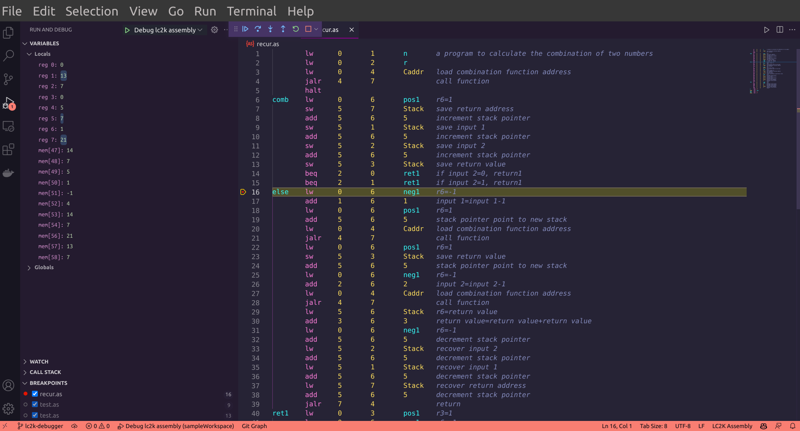

# VS Code LC2k-Debug

This is a modified version to VSCode Mock Debug [https://github.com/Microsoft/vscode-mock-debug.git](https://github.com/Microsoft/vscode-mock-debug.git)

demo picture:

---

# TODO

- [ ] can watch the value of variable
- [ ] use jalr to update call stack
- [ ] show the exception message in bubble not in debug console
